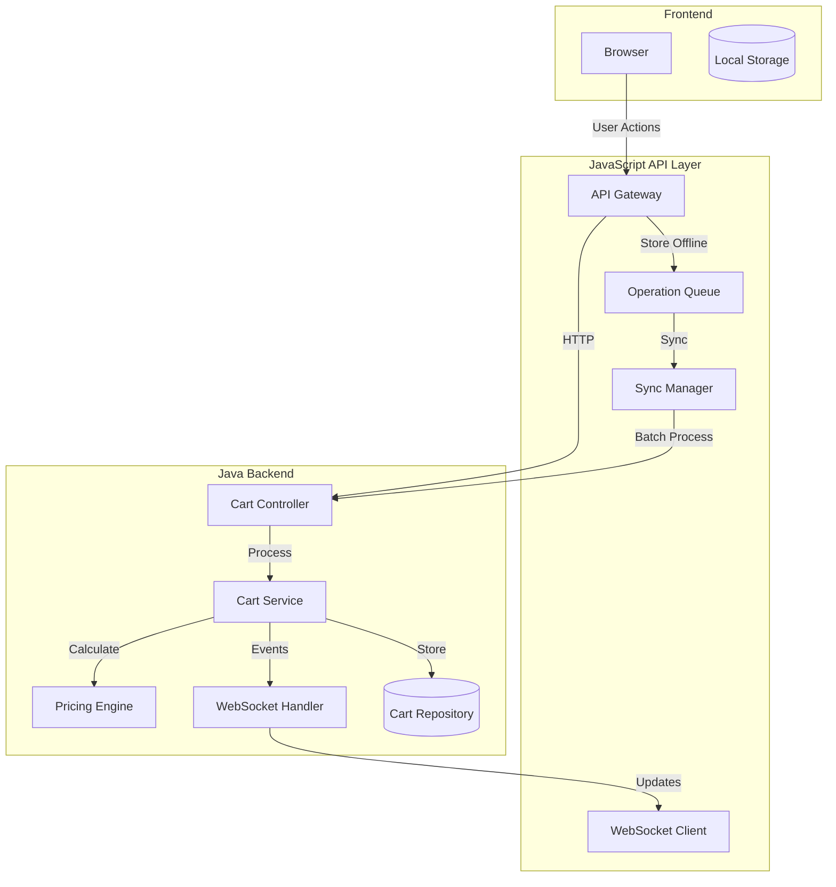
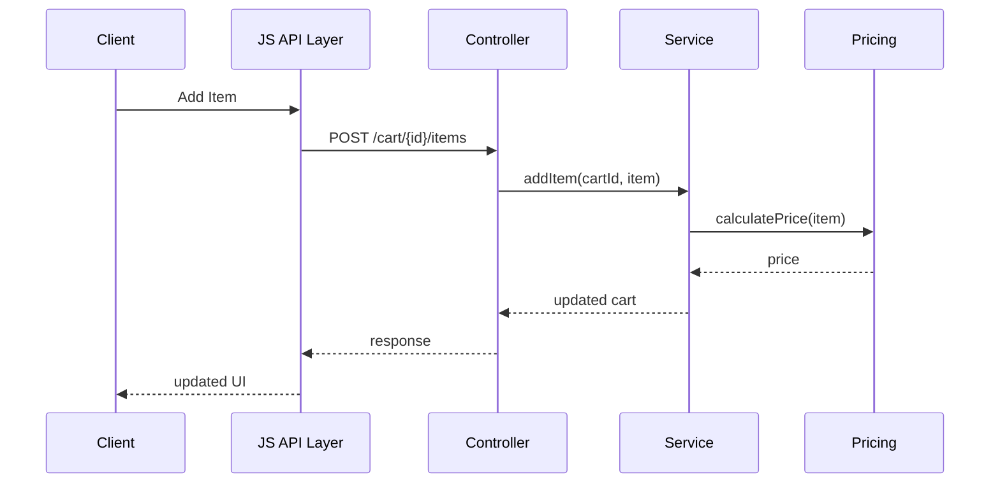
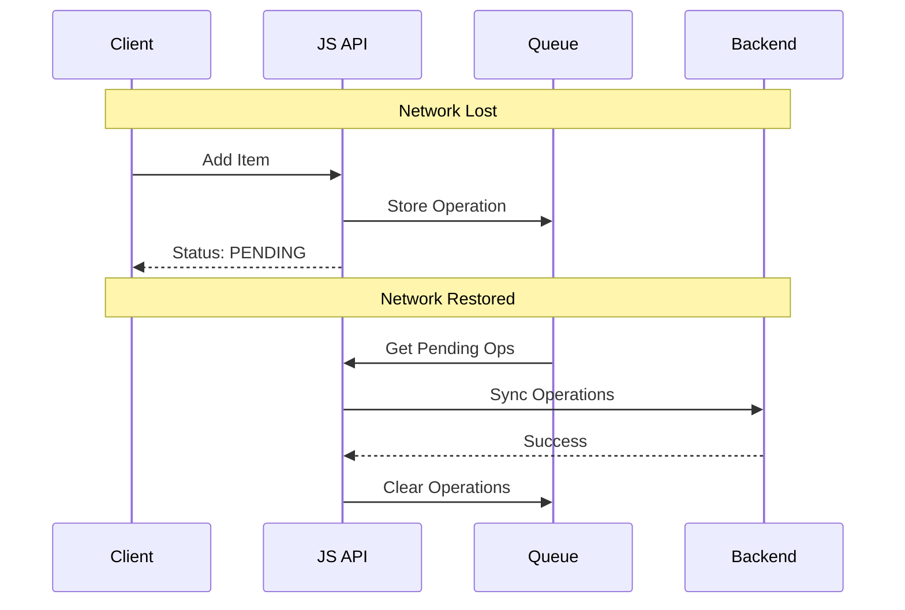
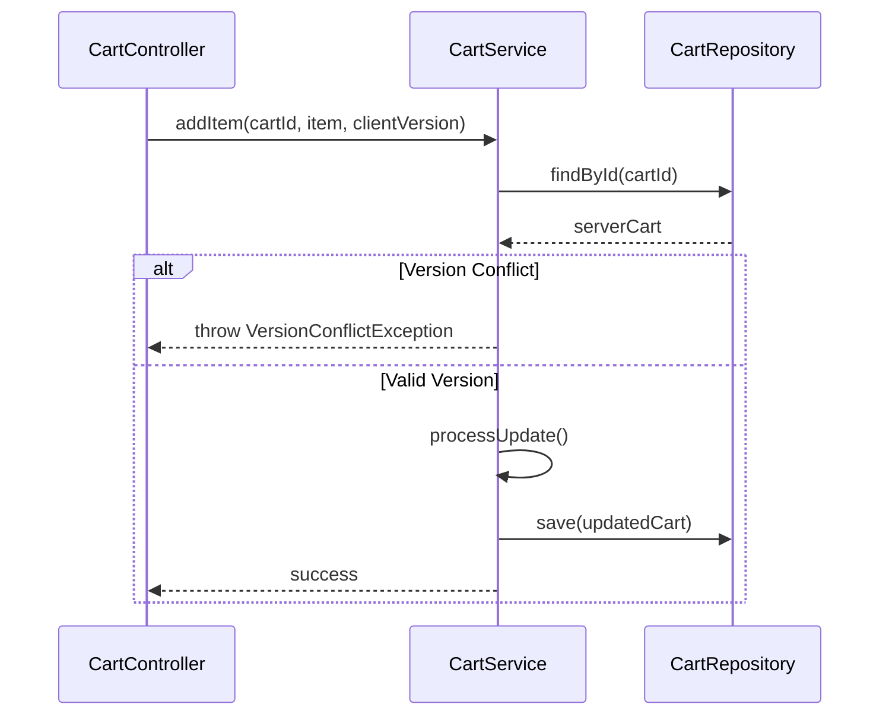
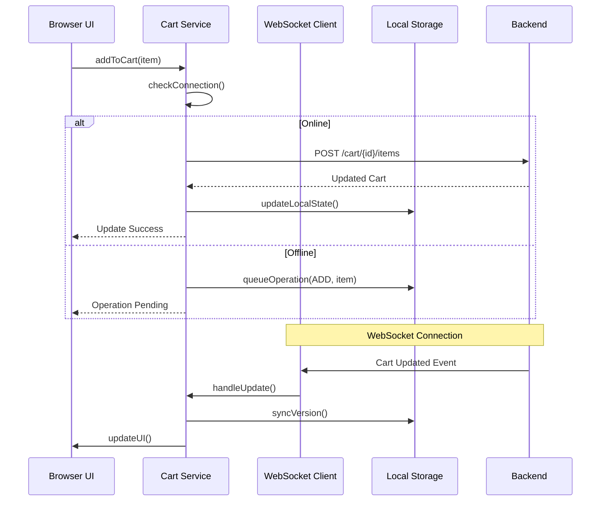
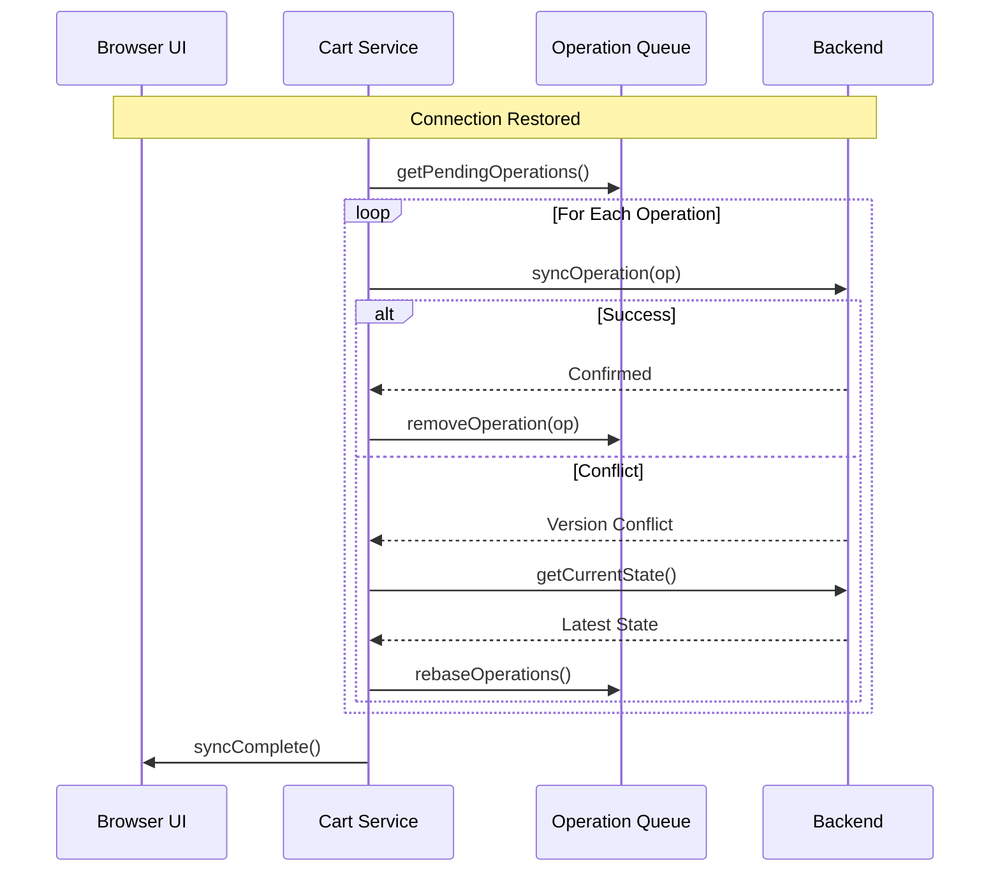
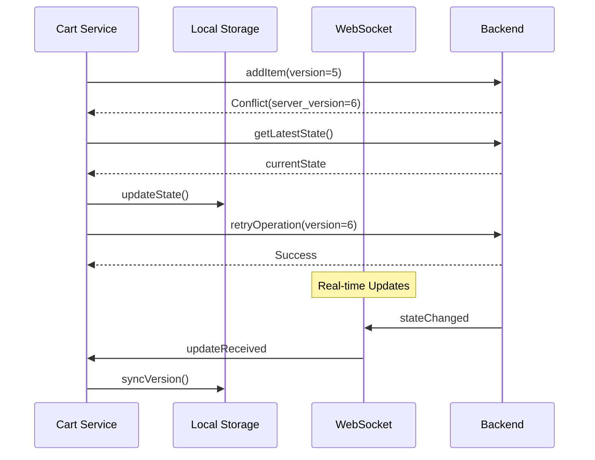
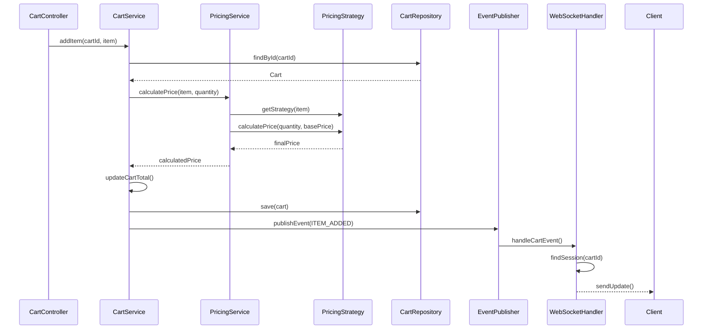
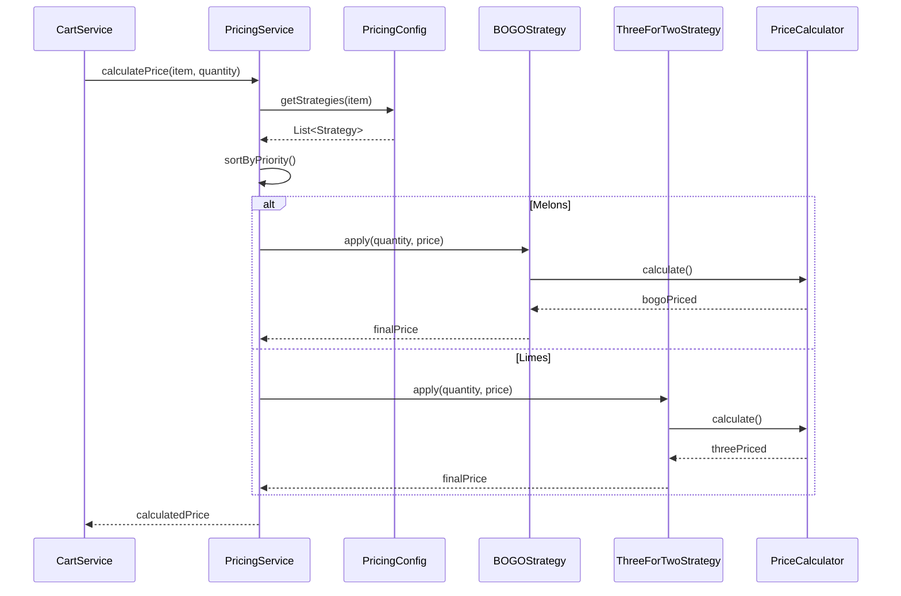
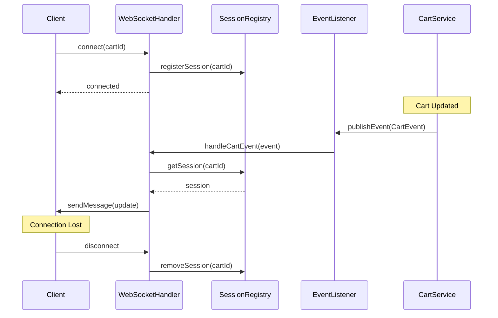

# Shopping Cart System

## Problem Statement
Given a list of shopping items, calculate the total cost of those items.

## Overview
Create a shopping cart system with the following components:
1. A Java backend service for core business logic and pricing rules
2. A JavaScript API layer to expose the shopping cart functionality
3. Real-time Synchronization Feature

## Requirements

### Part 1: Java Core
1. Implement the core shopping cart logic in Java:
- Calculate price of shopping basket
- Items presented one at a time (e.g., `Apple`, `Banana`)
- Multiple items can repeat (e.g., [`Apple`,`Apple`, `Banana`])

2. Pricing Rules:
- Apples: 35p each
- Bananas: 20p each
- Melons: 50p each (buy one get one free)
- Limes: 15p each (three for the price of two)

### Part 2: JavaScript API Layer
- Expose cart operation endpoints
- Communicate with Java backend
- Error handling and response formatting
- Basic authentication

### Part 3: Real-time Synchronization
- Maintain sync between frontend and backend
- Handle network outages
- Automatic conflict resolution

## System Architecture



## Component Interactions

### 1. Basic Cart Operation Flow


### 2. Offline Operation Flow


### 3. Version Conflict Resolution


## Implementation Details

### JavaScript API Layer
- API endpoints for cart operations
- Offline operation queue
- WebSocket client for real-time updates
- Version tracking
- Error handling

### Java Backend
Key components interaction:
1. CartController: Entry point for HTTP requests
2. CartService: Business logic and pricing
3. PricingStrategy: Price calculation rules
4. CartRepository: Storage operations
5. WebSocketHandler: Real-time updates
6. ErrorHandler: Centralized error management

Pricing Strategies:
- Regular pricing
- Buy One Get One Free
- Three for Two
- Multiple strategy support
  
## Design Choices & Trade-offs

### Current Design
1. Single client per cart assumption
2. Simple version tracking
3. Hybrid WebSocket + HTTP approach
4. Sequential sync for offline operations
5. In-memory storage
6. Basic authentication
7. Queue-based offline handling

### Future Improvements
- Advanced conflict resolution
- Persistent storage
- Advanced retry strategies

## API Endpoints

| Method | Endpoint | Purpose |
|--------|----------|---------|
| POST | /api/v1/cart | Create cart |
| GET | /api/v1/cart/{id} | Get cart |
| POST | /api/v1/cart/{id}/items | Add item |
| DELETE | /api/v1/cart/{id}/items/{item} | Remove item |
| DELETE | /api/v1/cart/{id} | Clear cart |
| POST | /api/v1/cart/{id}/sync | Sync offline operations |

WebSocket: ws://host/cart-ws/{cartId}

## Detailed Flow Diagrams

### JavaScript Layer Interactions

1. Online Operations:


2. Offline Sync:


3. Version Management:


### Java Backend Interactions

1. Cart Operation Processing:


2. Special Offer Processing:


3. WebSocket Management:


## Running the Project

```bash
# Start JavaScript API
cd api
npm install
npm start   # Runs on 3000
npm test

# Start Java Backend
cd backend
./mvnw clean install
./mvnw spring-boot:run  # Runs on 8080
```